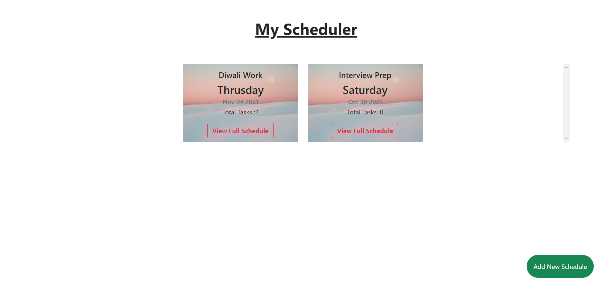
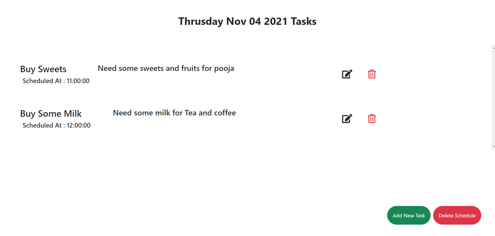
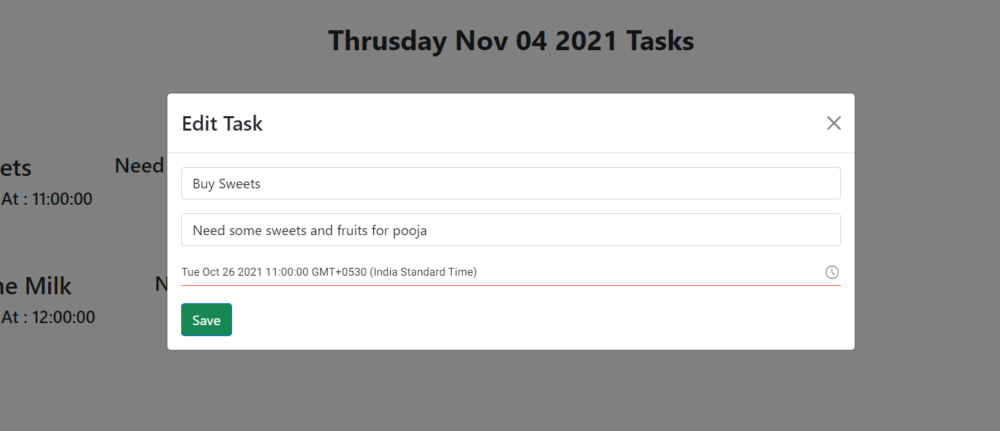
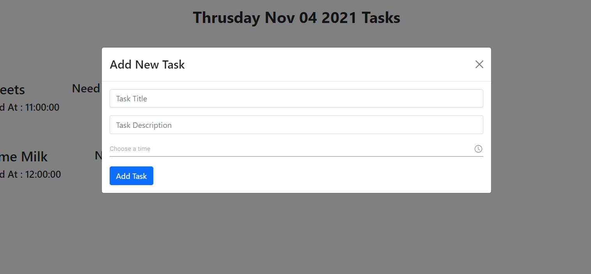

# My React Todo

This is a Powerful Scheduler app to manage tasks and schedules.

---
## Screenshots






## Built With

- ReactJS

## Getting Started

To get a local copy up and running follow these simple example steps.

```
git clone https://github.com/Hector096/my-react-todo.git
```

and then run

```
npm i
npm start
```

## Installation

to build a production version to `bulid` folder run

```
npm run build
```

## Authors
:bearded_person: **Hector**
  - GitHub: [@githubhandle](https://github.com/Hector096)
  - Linkedin: [@linkedinhandle](https://www.linkedin.com/in/vishal-verma-9191b8126/)


## 🤝 Contributing

Contributions, issues, and feature requests are welcome!

Feel free to check the [issues page](https://github.com/Hector096/my-react-todo.git/issues).

## Show your support

Give a ⭐️ if you like this project!

## Acknowledgments

- Hat tip to anyone whose code was used
- Inspiration
- etc
